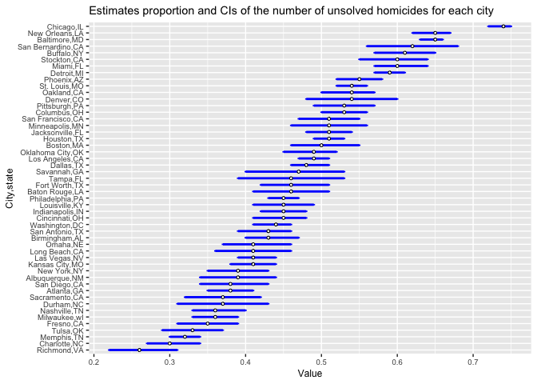
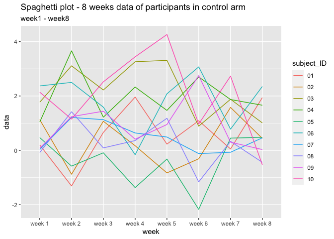

p8105\_hw5\_jl6049
================
LYU JING
11/13/2021

# Problem 1

``` r
library(tidyverse)
```

``` r
homicide = read.csv("homicide-data.csv", na = c("","Unknown"))


unique(homicide$disposition) #or use count()
```

    ## [1] "Closed without arrest" "Closed by arrest"      "Open/No arrest"

The dataset contains *52179* observations of homicides in 50 large U.S.
cities.

The dataset has 12 columns, including:

**numeric variables:**

-   `lat`
-   `lon`
-   `reported_date`

**character variables:**

-   `uid`
-   `victim_last`
-   `victim_first`
-   `victim_race`
-   `victim_age`
-   `victim_sex`
-   `city`
-   `state`
-   `disposition`

From the dataset, we could know the basic information of the victim in a
homicide(name, race, age and sex), place of the homicide and disposition
of the homicide.

``` r
homicide_number =
  homicide %>% 
  mutate(city_state = paste(city,state,sep = ",")) %>% # str_c(city,state)
  group_by(city_state) %>% 
  filter(city_state != "Tulsa,AL") %>% 
  summarise(n_homicide = n(),
            n_unsolved = sum((disposition == "Closed without arrest") | (disposition == "Open/No arrest"))
            )

n_baltimore_homicide = homicide_number %>% 
  filter(city_state == "Baltimore,MD") %>% 
  pull(n_homicide)

n_baltimore_usolved = homicide_number %>% 
  filter(city_state == "Baltimore,MD") %>% 
  pull(n_unsolved)

test = prop.test(n_baltimore_usolved,n_baltimore_homicide)
tidy_test = broom::tidy(test)

estimated_proportion = round(pull(tidy_test,estimate),2)
confidence_low  = round(pull(tidy_test,conf.low),2)
confidence_high  = round(pull(tidy_test,conf.high),2)

tibble(estimated_proportion,confidence_low,confidence_high)
```

    ## # A tibble: 1 × 3
    ##   estimated_proportion confidence_low confidence_high
    ##                  <dbl>          <dbl>           <dbl>
    ## 1                 0.65           0.63            0.66

Now run prop.test for each of the cities in your dataset, and extract
both the proportion of unsolved homicides and the confidence interval
for each. Do this within a “tidy” pipeline, making use of purrr::map,
purrr::map2, list columns and unnest as necessary to create a tidy
dataframe with estimated proportions and CIs for each city.

``` r
est_prop_ci = function(x){
  
  test = 
    prop.test(x$n_unsolved, x$n_homicide) %>% 
    broom::tidy()
  
  estimated_proportion = round(pull(test,estimate),2)
  confidence_low  = round(pull(test,conf.low),2)
  confidence_high  = round(pull(test,conf.high),2)

  return(tibble(estimated_proportion,confidence_low,confidence_high))
}

homicide_number_test_result =
  homicide_number %>% 
  nest(data = n_homicide:n_unsolved) %>% 
  mutate(summary = map(data, est_prop_ci)) %>% 
  select(-data) %>% 
  unnest(summary)

knitr::kable(homicide_number_test_result)
```

| city\_state       | estimated\_proportion | confidence\_low | confidence\_high |
|:------------------|----------------------:|----------------:|-----------------:|
| Albuquerque,NM    |                  0.39 |            0.34 |             0.44 |
| Atlanta,GA        |                  0.38 |            0.35 |             0.41 |
| Baltimore,MD      |                  0.65 |            0.63 |             0.66 |
| Baton Rouge,LA    |                  0.46 |            0.41 |             0.51 |
| Birmingham,AL     |                  0.43 |            0.40 |             0.47 |
| Boston,MA         |                  0.50 |            0.46 |             0.55 |
| Buffalo,NY        |                  0.61 |            0.57 |             0.65 |
| Charlotte,NC      |                  0.30 |            0.27 |             0.34 |
| Chicago,IL        |                  0.74 |            0.72 |             0.75 |
| Cincinnati,OH     |                  0.45 |            0.41 |             0.48 |
| Columbus,OH       |                  0.53 |            0.50 |             0.56 |
| Dallas,TX         |                  0.48 |            0.46 |             0.51 |
| Denver,CO         |                  0.54 |            0.48 |             0.60 |
| Detroit,MI        |                  0.59 |            0.57 |             0.61 |
| Durham,NC         |                  0.37 |            0.31 |             0.43 |
| Fort Worth,TX     |                  0.46 |            0.42 |             0.51 |
| Fresno,CA         |                  0.35 |            0.31 |             0.39 |
| Houston,TX        |                  0.51 |            0.49 |             0.53 |
| Indianapolis,IN   |                  0.45 |            0.42 |             0.48 |
| Jacksonville,FL   |                  0.51 |            0.48 |             0.54 |
| Kansas City,MO    |                  0.41 |            0.38 |             0.44 |
| Las Vegas,NV      |                  0.41 |            0.39 |             0.44 |
| Long Beach,CA     |                  0.41 |            0.36 |             0.46 |
| Los Angeles,CA    |                  0.49 |            0.47 |             0.51 |
| Louisville,KY     |                  0.45 |            0.41 |             0.49 |
| Memphis,TN        |                  0.32 |            0.30 |             0.34 |
| Miami,FL          |                  0.60 |            0.57 |             0.64 |
| Milwaukee,wI      |                  0.36 |            0.33 |             0.39 |
| Minneapolis,MN    |                  0.51 |            0.46 |             0.56 |
| Nashville,TN      |                  0.36 |            0.33 |             0.40 |
| New Orleans,LA    |                  0.65 |            0.62 |             0.67 |
| New York,NY       |                  0.39 |            0.35 |             0.43 |
| Oakland,CA        |                  0.54 |            0.50 |             0.57 |
| Oklahoma City,OK  |                  0.49 |            0.45 |             0.52 |
| Omaha,NE          |                  0.41 |            0.37 |             0.46 |
| Philadelphia,PA   |                  0.45 |            0.43 |             0.47 |
| Phoenix,AZ        |                  0.55 |            0.52 |             0.58 |
| Pittsburgh,PA     |                  0.53 |            0.49 |             0.57 |
| Richmond,VA       |                  0.26 |            0.22 |             0.31 |
| Sacramento,CA     |                  0.37 |            0.32 |             0.42 |
| San Antonio,TX    |                  0.43 |            0.39 |             0.46 |
| San Bernardino,CA |                  0.62 |            0.56 |             0.68 |
| San Diego,CA      |                  0.38 |            0.34 |             0.43 |
| San Francisco,CA  |                  0.51 |            0.47 |             0.55 |
| Savannah,GA       |                  0.47 |            0.40 |             0.53 |
| St. Louis,MO      |                  0.54 |            0.52 |             0.56 |
| Stockton,CA       |                  0.60 |            0.55 |             0.64 |
| Tampa,FL          |                  0.46 |            0.39 |             0.53 |
| Tulsa,OK          |                  0.33 |            0.29 |             0.37 |
| Washington,DC     |                  0.44 |            0.41 |             0.46 |

``` r
homicide_number_test_result %>% 
  mutate(
    city_state = fct_reorder(city_state,estimated_proportion)
    ) %>%
  ggplot() + 
  geom_errorbar(aes(x=city_state, ymin = confidence_low, ymax = confidence_high), width = 0.2, size=1, color = "blue") + 
  geom_point(aes(x = city_state,y = estimated_proportion),size = 1,shape = 21,fill = "white") +
  theme(text = element_text(size=9)) +
  coord_flip() +
  labs(
    title = "Estimates proportion and CIs of the number of unsolved homicides for each city",
    x = "City,state",
    y = "Value"
  )
```

<!-- -->

# Problem 2

``` r
list_file = list.files(path = "data")

read_data = function(x){
  data = read.csv(paste("data/",x, sep = "")) %>% 
    mutate(name = x)
  return(data)

}

data_participant = 
  map(list_file, read_data) %>% 
  bind_rows() %>% 
  relocate(name) %>% 
  mutate(name = str_remove(name, '.csv')) %>% 
  separate(name, into = c("arm", "subject_ID"), sep = "_") %>% 
  filter(arm =="con") %>% 
  pivot_longer(
    week_1:week_8,
    names_to = "week", 
    values_to = "data") %>% 
  mutate(
    week = str_replace(week, "_", " ")
  )
```

Make a spaghetti plot showing observations on each subject over time,
and comment on differences between groups.

``` r
data_participant %>% 
  ggplot(aes(x = week, y = data, group = subject_ID)) + 
  geom_line(aes(color = subject_ID)) + 
  theme(legend.position = "right") + 
  labs(
    title = "Spaghetti plot - 8 weeks data of participants in control arm",
    subtitle = "week1 - week8",
  )
```

<!-- -->

The differences between the data of 10 participants in control arm have
patterns as follows:

1.  difference in week 5 is the largest and then gradually converge in
    next several weeks.

2.  the difference in week 8 is the smallest.

3.  seems like the difference are from chaos to order

# problem 3

``` r
set.seed(10)

iris_with_missing = iris %>% 
  map_df(~replace(.x, sample(1:150, 20), NA)) %>%
  mutate(Species = as.character(Species))
```

``` r
fill_missing = function(x){
  if (is.numeric(x)) {
    fill = replace_na(x,round(mean(x,na.rm = TRUE),1))
  } 
  else if (is.character(x)) {
    fill = replace_na(x,"virginica")
  }
  else{
    fill = "wrong"
  }
  return(fill)
}

iris_recover = 
  iris_with_missing %>% 
  map_df(fill_missing) %>% 
  knitr::kable()
  

iris_recover
```

| Sepal.Length | Sepal.Width | Petal.Length | Petal.Width | Species    |
|-------------:|------------:|-------------:|------------:|:-----------|
|          5.1 |         3.5 |          1.4 |         0.2 | setosa     |
|          4.9 |         3.0 |          1.4 |         0.2 | setosa     |
|          4.7 |         3.2 |          1.3 |         0.2 | setosa     |
|          4.6 |         3.1 |          1.5 |         1.2 | setosa     |
|          5.0 |         3.6 |          1.4 |         0.2 | setosa     |
|          5.4 |         3.9 |          1.7 |         0.4 | setosa     |
|          5.8 |         3.4 |          1.4 |         0.3 | setosa     |
|          5.0 |         3.4 |          1.5 |         0.2 | setosa     |
|          4.4 |         2.9 |          1.4 |         0.2 | setosa     |
|          4.9 |         3.1 |          3.8 |         0.1 | setosa     |
|          5.4 |         3.1 |          1.5 |         0.2 | setosa     |
|          4.8 |         3.4 |          1.6 |         0.2 | setosa     |
|          5.8 |         3.1 |          1.4 |         0.1 | setosa     |
|          4.3 |         3.0 |          3.8 |         0.1 | setosa     |
|          5.8 |         4.0 |          3.8 |         0.2 | setosa     |
|          5.7 |         4.4 |          1.5 |         0.4 | setosa     |
|          5.4 |         3.9 |          1.3 |         0.4 | setosa     |
|          5.1 |         3.5 |          1.4 |         1.2 | setosa     |
|          5.7 |         3.8 |          1.7 |         0.3 | setosa     |
|          5.1 |         3.8 |          1.5 |         1.2 | setosa     |
|          5.4 |         3.4 |          1.7 |         0.2 | setosa     |
|          5.1 |         3.7 |          1.5 |         0.4 | virginica  |
|          4.6 |         3.6 |          1.0 |         0.2 | setosa     |
|          5.8 |         3.3 |          3.8 |         0.5 | setosa     |
|          4.8 |         3.4 |          1.9 |         0.2 | virginica  |
|          5.0 |         3.0 |          3.8 |         0.2 | setosa     |
|          5.0 |         3.4 |          1.6 |         0.4 | virginica  |
|          5.2 |         3.5 |          1.5 |         0.2 | setosa     |
|          5.8 |         3.4 |          1.4 |         0.2 | setosa     |
|          4.7 |         3.2 |          1.6 |         0.2 | setosa     |
|          4.8 |         3.1 |          3.8 |         0.2 | setosa     |
|          5.4 |         3.1 |          1.5 |         0.4 | setosa     |
|          5.2 |         3.1 |          1.5 |         0.1 | setosa     |
|          5.5 |         4.2 |          1.4 |         0.2 | setosa     |
|          4.9 |         3.1 |          3.8 |         0.2 | setosa     |
|          5.0 |         3.2 |          1.2 |         0.2 | setosa     |
|          5.5 |         3.5 |          1.3 |         0.2 | setosa     |
|          4.9 |         3.6 |          1.4 |         0.1 | setosa     |
|          4.4 |         3.0 |          1.3 |         1.2 | setosa     |
|          5.1 |         3.4 |          1.5 |         0.2 | setosa     |
|          5.0 |         3.5 |          1.3 |         0.3 | setosa     |
|          4.5 |         3.1 |          1.3 |         1.2 | virginica  |
|          4.4 |         3.2 |          1.3 |         0.2 | setosa     |
|          5.0 |         3.5 |          1.6 |         0.6 | setosa     |
|          5.1 |         3.8 |          1.9 |         0.4 | setosa     |
|          4.8 |         3.0 |          1.4 |         0.3 | virginica  |
|          5.1 |         3.8 |          1.6 |         0.2 | setosa     |
|          4.6 |         3.2 |          3.8 |         0.2 | setosa     |
|          5.3 |         3.7 |          1.5 |         0.2 | setosa     |
|          5.0 |         3.1 |          1.4 |         0.2 | setosa     |
|          7.0 |         3.1 |          4.7 |         1.4 | virginica  |
|          6.4 |         3.2 |          4.5 |         1.5 | versicolor |
|          6.9 |         3.1 |          4.9 |         1.5 | versicolor |
|          5.5 |         2.3 |          4.0 |         1.3 | versicolor |
|          6.5 |         2.8 |          4.6 |         1.5 | versicolor |
|          5.7 |         2.8 |          4.5 |         1.3 | versicolor |
|          6.3 |         3.3 |          4.7 |         1.6 | virginica  |
|          4.9 |         2.4 |          3.8 |         1.0 | versicolor |
|          6.6 |         2.9 |          4.6 |         1.3 | virginica  |
|          5.2 |         2.7 |          3.9 |         1.4 | versicolor |
|          5.0 |         2.0 |          3.8 |         1.0 | versicolor |
|          5.9 |         3.0 |          4.2 |         1.5 | versicolor |
|          6.0 |         2.2 |          4.0 |         1.2 | versicolor |
|          6.1 |         2.9 |          4.7 |         1.4 | versicolor |
|          5.6 |         2.9 |          3.6 |         1.3 | versicolor |
|          6.7 |         3.1 |          4.4 |         1.4 | versicolor |
|          5.6 |         3.0 |          4.5 |         1.5 | versicolor |
|          5.8 |         3.1 |          4.1 |         1.0 | versicolor |
|          6.2 |         2.2 |          4.5 |         1.5 | versicolor |
|          5.6 |         2.5 |          3.9 |         1.1 | versicolor |
|          5.9 |         3.2 |          4.8 |         1.8 | versicolor |
|          5.8 |         2.8 |          4.0 |         1.3 | virginica  |
|          6.3 |         2.5 |          4.9 |         1.5 | versicolor |
|          5.8 |         2.8 |          3.8 |         1.2 | versicolor |
|          6.4 |         2.9 |          4.3 |         1.3 | versicolor |
|          6.6 |         3.0 |          4.4 |         1.4 | versicolor |
|          6.8 |         2.8 |          4.8 |         1.4 | versicolor |
|          6.7 |         3.1 |          5.0 |         1.2 | versicolor |
|          6.0 |         3.1 |          4.5 |         1.2 | versicolor |
|          5.7 |         2.6 |          3.5 |         1.0 | virginica  |
|          5.5 |         2.4 |          3.8 |         1.1 | versicolor |
|          5.8 |         2.4 |          3.7 |         1.0 | versicolor |
|          5.8 |         2.7 |          3.9 |         1.2 | versicolor |
|          6.0 |         2.7 |          5.1 |         1.6 | versicolor |
|          5.4 |         3.0 |          4.5 |         1.5 | versicolor |
|          5.8 |         3.4 |          4.5 |         1.6 | versicolor |
|          6.7 |         3.1 |          4.7 |         1.2 | versicolor |
|          5.8 |         3.1 |          4.4 |         1.3 | versicolor |
|          5.6 |         3.0 |          3.8 |         1.2 | versicolor |
|          5.5 |         2.5 |          4.0 |         1.2 | versicolor |
|          5.5 |         3.1 |          4.4 |         1.2 | versicolor |
|          5.8 |         3.1 |          4.6 |         1.2 | versicolor |
|          5.8 |         3.1 |          4.0 |         1.2 | versicolor |
|          5.0 |         2.3 |          3.3 |         1.2 | virginica  |
|          5.8 |         2.7 |          4.2 |         1.3 | versicolor |
|          5.7 |         3.0 |          4.2 |         1.2 | versicolor |
|          5.7 |         2.9 |          4.2 |         1.3 | versicolor |
|          6.2 |         2.9 |          4.3 |         1.3 | versicolor |
|          5.1 |         2.5 |          3.0 |         1.2 | versicolor |
|          5.7 |         2.8 |          4.1 |         1.3 | virginica  |
|          6.3 |         3.1 |          3.8 |         2.5 | virginica  |
|          5.8 |         2.7 |          5.1 |         1.9 | virginica  |
|          7.1 |         3.0 |          5.9 |         2.1 | virginica  |
|          6.3 |         2.9 |          5.6 |         1.8 | virginica  |
|          6.5 |         3.1 |          5.8 |         2.2 | virginica  |
|          7.6 |         3.0 |          6.6 |         2.1 | virginica  |
|          4.9 |         2.5 |          4.5 |         1.7 | virginica  |
|          7.3 |         2.9 |          6.3 |         1.8 | virginica  |
|          6.7 |         3.1 |          3.8 |         1.8 | virginica  |
|          5.8 |         3.6 |          3.8 |         2.5 | virginica  |
|          6.5 |         3.2 |          5.1 |         2.0 | virginica  |
|          5.8 |         2.7 |          5.3 |         1.9 | virginica  |
|          6.8 |         3.0 |          5.5 |         2.1 | virginica  |
|          5.7 |         3.1 |          5.0 |         2.0 | virginica  |
|          5.8 |         2.8 |          5.1 |         2.4 | virginica  |
|          6.4 |         3.2 |          5.3 |         2.3 | virginica  |
|          6.5 |         3.0 |          3.8 |         1.8 | virginica  |
|          7.7 |         3.8 |          6.7 |         1.2 | virginica  |
|          7.7 |         2.6 |          6.9 |         2.3 | virginica  |
|          6.0 |         2.2 |          5.0 |         1.5 | virginica  |
|          5.8 |         3.2 |          5.7 |         1.2 | virginica  |
|          5.6 |         3.1 |          4.9 |         2.0 | virginica  |
|          7.7 |         2.8 |          6.7 |         2.0 | virginica  |
|          6.3 |         2.7 |          4.9 |         1.8 | virginica  |
|          6.7 |         3.3 |          5.7 |         2.1 | virginica  |
|          7.2 |         3.2 |          6.0 |         1.8 | virginica  |
|          6.2 |         2.8 |          4.8 |         1.8 | virginica  |
|          6.1 |         3.0 |          4.9 |         1.8 | virginica  |
|          6.4 |         2.8 |          5.6 |         2.1 | virginica  |
|          7.2 |         3.0 |          5.8 |         1.6 | virginica  |
|          7.4 |         2.8 |          6.1 |         1.2 | virginica  |
|          7.9 |         3.8 |          3.8 |         2.0 | virginica  |
|          6.4 |         2.8 |          3.8 |         2.2 | virginica  |
|          5.8 |         2.8 |          5.1 |         1.5 | virginica  |
|          6.1 |         3.1 |          5.6 |         1.4 | virginica  |
|          5.8 |         3.0 |          6.1 |         2.3 | virginica  |
|          5.8 |         3.4 |          5.6 |         1.2 | virginica  |
|          6.4 |         3.1 |          5.5 |         1.2 | virginica  |
|          6.0 |         3.0 |          4.8 |         1.8 | virginica  |
|          6.9 |         3.1 |          5.4 |         2.1 | virginica  |
|          6.7 |         3.1 |          5.6 |         2.4 | virginica  |
|          6.9 |         3.1 |          5.1 |         2.3 | virginica  |
|          5.8 |         2.7 |          5.1 |         1.9 | virginica  |
|          6.8 |         3.2 |          3.8 |         2.3 | virginica  |
|          6.7 |         3.3 |          3.8 |         2.5 | virginica  |
|          6.7 |         3.0 |          5.2 |         2.3 | virginica  |
|          6.3 |         2.5 |          5.0 |         1.9 | virginica  |
|          6.5 |         3.0 |          5.2 |         2.0 | virginica  |
|          5.8 |         3.4 |          5.4 |         2.3 | virginica  |
|          5.9 |         3.0 |          5.1 |         1.8 | virginica  |
